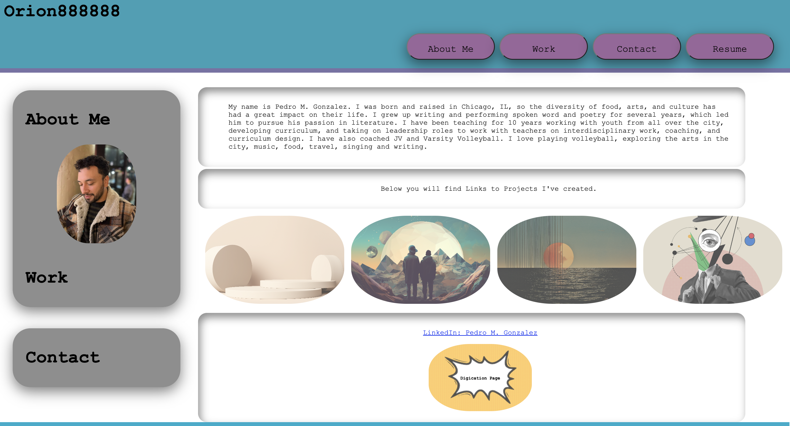

# 02 Advanced CSS: Portfolio

## Purpose and Display

This is a portfolio of work that showcases my skills and talents as a developer as well as a look into the creative lens that I have as a designer. The portfolio highlights strong projects as well as the thought processes behind it. This portfolios begins the the steppings stones to a more polished apprach to the development of a webpage that evokes who I am as a developer and designer.

Below you will find a diplay picture of the webpage in full lenght.




## User Story

```
AS AN employer
I WANT to view a potential employee's deployed portfolio of work samples
SO THAT I can review samples of their work and assess whether they're a good candidate for an open position
```


## Acceptance Criteria

Here are the critical requirements necessary to develop a portfolio that satisfies a typical hiring manager’s needs:

```
GIVEN I need to sample a potential employee's previous work
WHEN I load their portfolio
THEN I am presented with the developer's name, a recent photo or avatar, and links to sections about them, their work, and how to contact them
WHEN I click one of the links in the navigation
THEN the UI scrolls to the corresponding section
WHEN I click on the link to the section about their work
THEN the UI scrolls to a section with titled images of the developer's applications
WHEN I am presented with the developer's first application
THEN that application's image should be larger in size than the others
WHEN I click on the images of the applications
THEN I am taken to that deployed application
WHEN I resize the page or view the site on various screens and devices
THEN I am presented with a responsive layout that adapts to my viewport
```